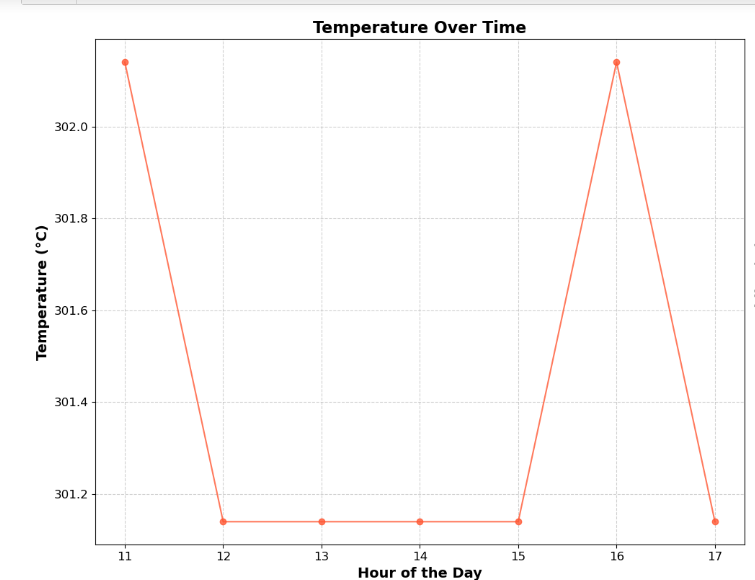
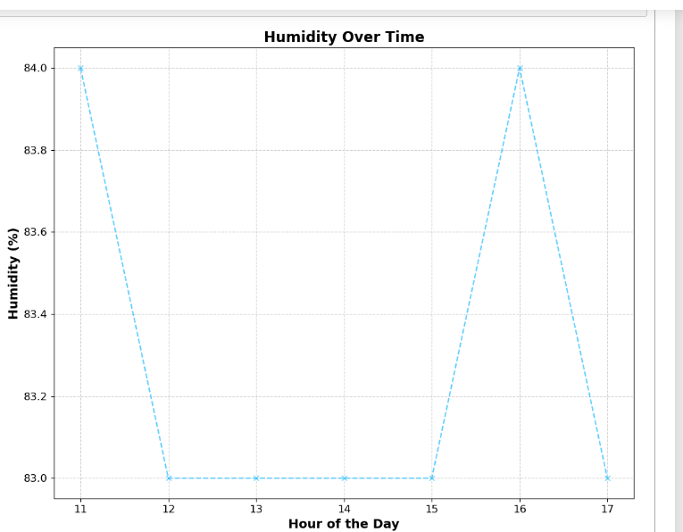
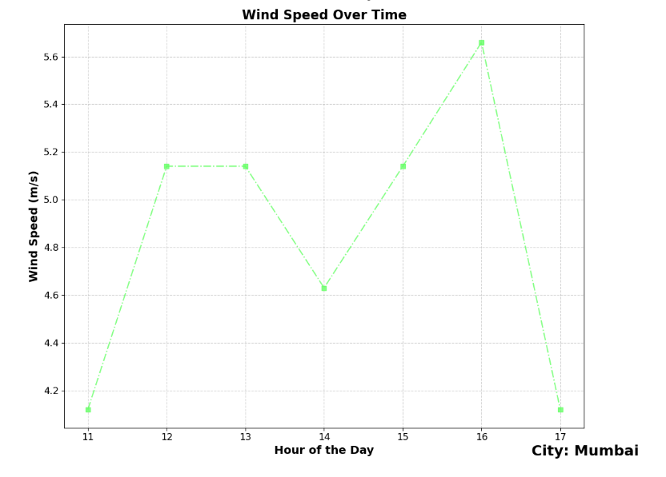
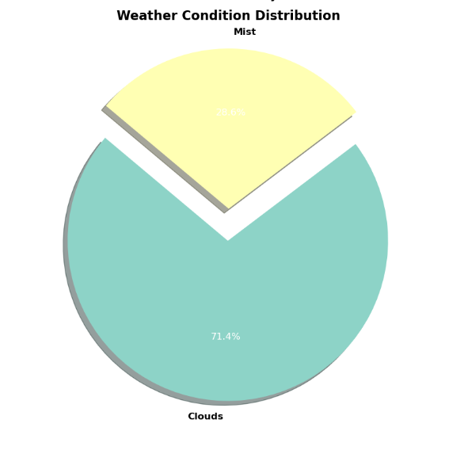

# **Weather Data Aggregator and Analyzer**

## **Overview**

This project is a **Weather Data Aggregator and Analyzer** that fetches weather data from the OpenWeatherMap API, stores it in a local SQLite database, and provides analysis and visualization of weather trends over time. The application also imports weather data from a CSV file.

## **Features**

- **Fetches real-time weather data using OpenWeatherMap API.**
- **Stores weather data in a local SQLite database.**
- **Imports and cleans weather data from a CSV file.**
- **Provides visualizations for temperature, humidity, wind speed, and weather condition distribution.**

## **Setup Instructions**

1. **Clone the repository:**

    ```bash
    git clone https://github.com/sagarvaidya4477/project1
    cd weather-data-analyzer
    ```

2. **Install dependencies:**

    ```bash
    pip install -r requirements.txt
    ```

3. **Create the database and fetch initial weather data:**

    Uncomment the lines in the `main` function of `weather_analyzer.py` to create the database and fetch initial weather data from the OpenWeatherMap API.

    ```python
    create_db()
    data = fetch_weather_data(API_KEY, LOCATION)
    temperature = data['main']['temp']
    humidity = data['main']['humidity']
    wind_speed = data['wind']['speed']
    weather = data['weather'][0]['main']
    insert_weather_data(temperature, humidity, wind_speed, weather)
    ```

4. **Run the application:**

    ```bash
    python weather_analyzer.py
    ```

5. **Import CSV data:**

    Place your CSV file (`final_df.csv`) in the project directory. Ensure it has columns named `temp`, `humidity`, `speed`, `dt`, and `name`. The `import_and_clean_csv` function will handle the renaming of these columns.

6. **Filter and plot data:**

    The `main` function currently filters data for the city of 'Mumbai'. You can change the city by modifying the `main` function argument.

## Visualizations
## 1. Temperature Over Time
Description:
This graph shows the variation in temperature over a specified time period. The x-axis represents time (which could be in hours, days, or weeks, depending on your data granularity), while the y-axis represents temperature in degrees Celsius (or Fahrenheit). This visualization helps in understanding how the temperature changes throughout the day or over different days. For example, you can identify temperature trends, such as whether it gets hotter or colder at specific times.



## 2. Humidity Over Time
Description:
The humidity over time graph displays how the humidity levels change over the same time period as the temperature. The x-axis represents time, and the y-axis represents relative humidity as a percentage. This graph helps in tracking changes in humidity, which can be useful for understanding weather patterns and how they correlate with temperature changes.



## 3. Wind Speed Over Time
Description:
This visualization depicts the variation in wind speed over time. The x-axis shows the time period, while the y-axis represents wind speed, typically measured in kilometers per hour (km/h) or miles per hour (mph). By analyzing this graph, you can see how wind speed fluctuates and identify any patterns or trends, such as higher wind speeds during certain times of the day or week.



## 4. Weather Condition Distribution
Description:
The weather condition distribution graph illustrates the frequency of different weather conditions recorded during the observation period. This might include conditions like sunny, rainy, cloudy, or windy. The x-axis lists different weather conditions, while the y-axis represents the count or percentage of time each condition occurred. This visualization provides an overview of the predominant weather conditions and their distribution, helping to understand the overall weather pattern in the given timeframe.



## Summary
Together, these visualizations offer a comprehensive view of weather patterns and conditions over time. They allow you to track and analyze changes in temperature, humidity, and wind speed, as well as the distribution of various weather conditions. This can be valuable for various applications, including weather forecasting, climate studies, and general weather trend analysis.
